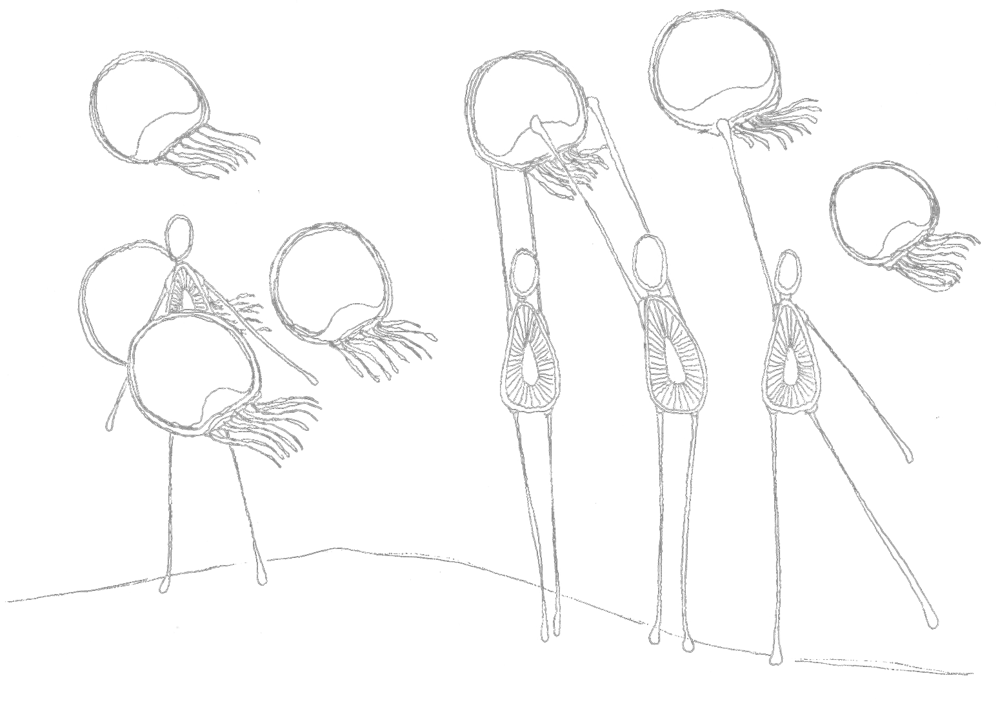

  <!--  -->
  

## Vida y partículas 
Proyecto de estudio           
Programado por Nicolás Donoso usando <a href='https://github.com/muinicomuiser/muijs-cuerpos'>muijs-cuerpos</a>     
Completamente en Español          

## Descripción
En proceso        
Habrá un conjunto de partículas de colores distintos.   
Cada partícula será atraída o repelida por otras partículas según un conjunto de reglas que 
definan cómo interactúan las partículas según sus colores.

## Proyectos creados con mui.js
- <a href="https://muinicomuiser.github.io/mui-js/" target="_blank">Figuras geométricas y colisiones</a>
- <a href="https://muinicomuiser.github.io/boids" target="_blank">boids</a>
- <a href="https://muinicomuiser.github.io/Juego-de-la-vida" target="_blank">Juego de la Vida</a>
